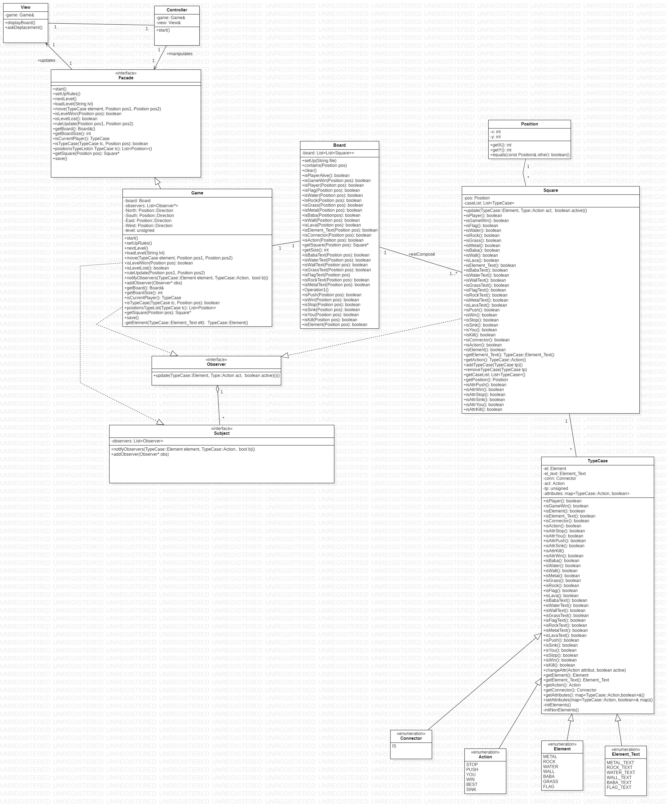

# Project DEV4 : Baba Is You

## Autors 
This project is made by Timmermans Cédric 58497 and Lejeune Mathéo 58738

## Comments
This game is called 'Baba is You', it is a student-led training project, and is a C++ rewrite of the original game 'Baba is You' by Arvi Teikari made during the 2017 Nordic Game Jam

## Implementation
The game uses a Board that is a 2D array of Squares. Content is added/removed from Squares as the various elements move on the Board.
A Square can have multiple elements and every elements uses a map of attributes that is read every time there is an interaction with the Square.  
This map of attributes is based on the 'rules' dispersed around the Board, a rule is always composed of an Element_Text, a Connector, and an Action. If a rule is broken by moving parts of it then all concerned Elements are updated.  
Example: on the board we can find "Wall is Stop" meaning that nothing can pass through walls, but if that rule is broken the walls are passable!

Levels are .txt files that follow strict rules to be correctly parsed: 'element x-axix y-axis orientation(optional)'. For example 'baba 5 7' means that the element 'baba' will be at the x-axis 5 and y-axis 7'.   
Note: we did not implement the orientation.  

The Observer - Subject pattern is used for Square - Game, allowing Squares to be directly updated with up-to-date rules.  
The Model-View-Controller is used for the general implementation.

The text-based encoding of levels created by Yahya Ouamar 🙏🏼

